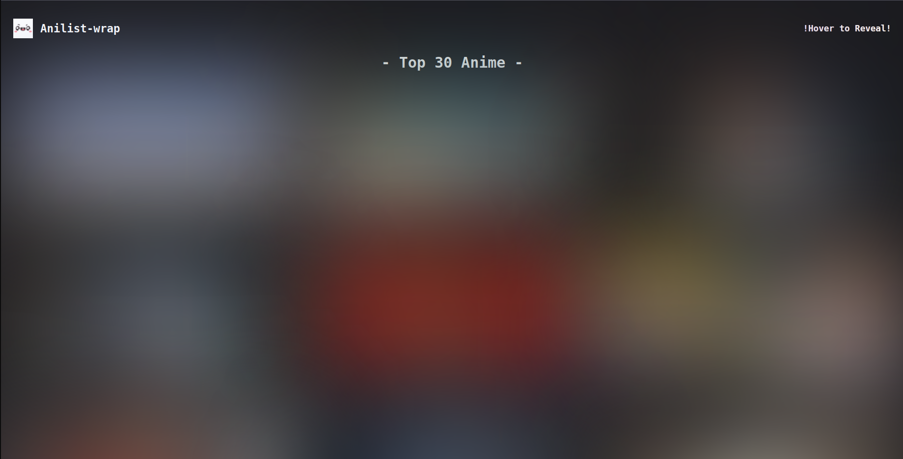
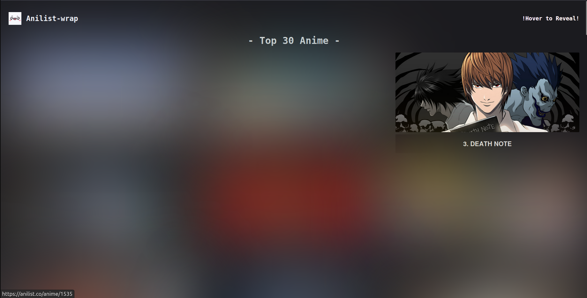

# 🎀 Anilist-wrap

Anilist-wrap is a simple Rails application that fetches and displays the top 20 anime and manga from the [Anilist](https://docs.anilist.co/) API.
The app showcases images, titles, and links to the Anilist website for each anime and manga.

### Screenshots



### Features

   - Displays the top 20 anime and manga based on popularity.
   - Click on the images to visit the respective Anilist pages.
   - Smooth hover effects and responsive design.
   - Beautiful UI with image and title display.

### Installation
1. Clone this repository:
```bash
git clone https://github.com/yourusername/anilist-wrap.git
```

2. Change directory
```bash
cd anilist-wrap
```

3. Install the required gems:
```bash
bundle install
```

4. Run the Rails server:
```bash
rails server
```
5. Visit the app in your browser:
```
http://localhost:3000
```

